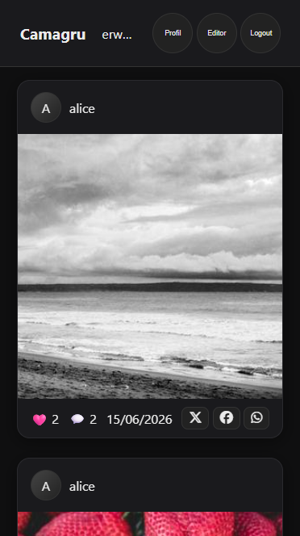
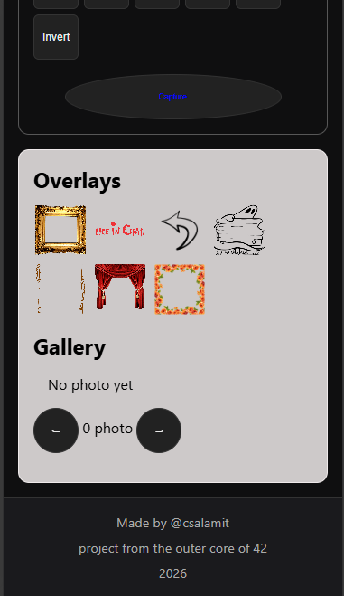

# Camagru






## use

## DOWNLOAD

git clone https://github.com/Cyrilange/Camagru.git <\NULL or name >

### LINUX

make 
make clean
make fclean
make re


### WINDOWS / LINUX / MC OS

docker 

## Stack
- Node.js + Express (server side)
- MariaDB + mysql2
- Docker + Nginx
- Nodemailer + Ethereal (email)
- HTML, CSS, JavaScript (frontend)

## Run the project
```bash
make up
```

## Test the routes
REST Client (VS Code) — `test.http` file at the root.

---

## Auth API ✅

| Method | Route | Description |
|--------|-------|-------------|
| POST | `/api/auth/register` | Create an account |
| POST | `/api/auth/login` | Log in |
| POST | `/api/auth/logout` | Log out |
| GET | `/api/auth/me` | Get connected user |
| GET | `/api/auth/verify?token=xxx` | Verify email |

### Rules
- Username: 3-20 chars, letters/numbers/- _
- Email: valid format
- Password: 8+ chars, 1 uppercase, 1 number, 1 special character

### Registration flow
1. `POST /register` → account created + email sent
2. Click the link in the email → `GET /verify?token=xxx`
3. Account activated → `POST /login`

---

## Security
- Passwords hashed with bcrypt (cost 12)
- Sessions with express-session
- Email verification required before login
- All credentials stored in `.env`
- SQL injection protected via prepared statements